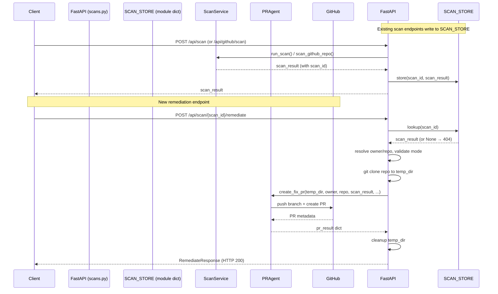
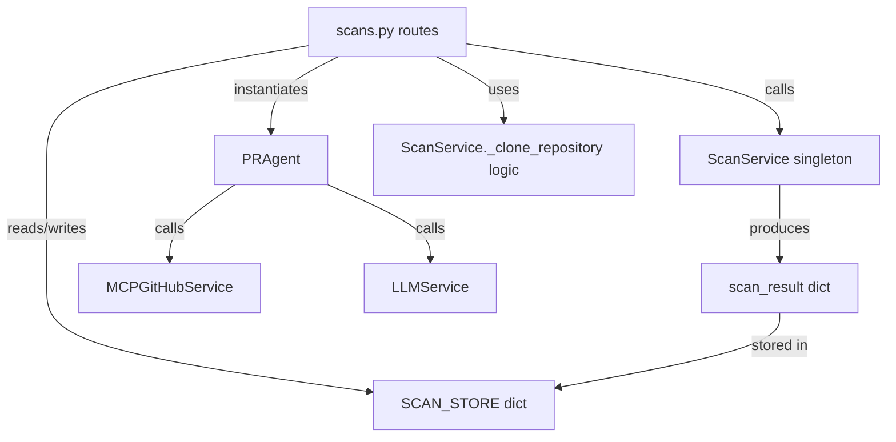

# Design Document: remediation-api-endpoint

## Overview

This feature adds a `POST /api/scan/{scan_id}/remediate` endpoint to the Code Intelligence Platform's FastAPI backend. It also implements the previously stubbed `GET /api/scan/{scan_id}` endpoint and introduces a lightweight in-memory Scan_Store so that scan results produced during a process lifetime are retrievable by ID.

The endpoint bridges the gap between the existing `PRAgent.create_fix_pr()` capability (currently only reachable via CLI or the `create_pr=True` flag on `ScanService.scan_github_repo()`) and API consumers such as the frontend dashboard or CI integrations.

### Key Design Decisions

- **In-memory store only**: Persistence across restarts is out of scope. A module-level dict in `scans.py` is sufficient and avoids introducing a database dependency.
- **PRAgent instantiation**: The remediation endpoint creates its own `PRAgent` instance rather than reaching into `ScanService.pr_agent`, keeping the route layer independent of the service's internal state.
- **Temp clone**: `PRAgent.create_fix_pr()` requires a local repo path. The endpoint clones the target repo into a `tempfile.mkdtemp()` directory and cleans it up in a `finally` block, mirroring the pattern already used in `ScanService.scan_github_repo()`.
- **No new files for the store**: The `SCAN_STORE` dict and the helper to register results live in `scans.py` alongside the existing route definitions, keeping the surface area minimal.

---

## Architecture



### Component Interaction



---

## Components and Interfaces

### SCAN_STORE

A module-level dictionary in `backend/app/api/routes/scans.py`:

```python
SCAN_STORE: Dict[str, Dict[str, Any]] = {}
```

Two helper functions manage it:

```python
def store_scan_result(scan_result: Dict[str, Any]) -> None:
    """Store a scan result keyed by its scan_id."""
    scan_id = scan_result.get("scan_id")
    if scan_id:
        SCAN_STORE[scan_id] = scan_result

def get_scan_result(scan_id: str) -> Optional[Dict[str, Any]]:
    """Return the scan result for scan_id, or None if absent."""
    return SCAN_STORE.get(scan_id)
```

Existing scan endpoints (`POST /api/scan` and `POST /api/github/scan`) are updated to call `store_scan_result()` after a successful scan.

### Pydantic Models

```python
from typing import Literal, Optional
from pydantic import BaseModel, field_validator

class RemediateRequest(BaseModel):
    remediation_mode: Optional[str] = None   # "deterministic" | "nondeterministic"
    owner: Optional[str] = None
    repo: Optional[str] = None
    base_branch: str = "main"

    @field_validator("remediation_mode")
    @classmethod
    def validate_mode(cls, v):
        if v is not None and v not in ("deterministic", "nondeterministic"):
            raise ValueError("remediation_mode must be 'deterministic' or 'nondeterministic'")
        return v

class RemediateResponse(BaseModel):
    scan_id: str
    created: bool
    mode: str
    branch: Optional[str] = None
    pull_request: Optional[Dict[str, Any]] = None
    reason: Optional[str] = None
```

### Remediation Endpoint

`POST /api/scan/{scan_id}/remediate`

**Handler logic (pseudocode):**

```
1. Look up scan_id in SCAN_STORE → 404 if missing
2. Resolve owner/repo:
   a. Use request.owner / request.repo if provided
   b. Else parse scan_result["repository"] ("owner/repo" format)
   c. If still unresolved → 422
3. Resolve remediation_mode:
   a. Use request.remediation_mode if provided
   b. Else os.getenv("REMEDIATION_MODE", "deterministic")
4. Log: scan_id, owner/repo, mode (INFO)
5. Clone repo to temp_dir (git clone --depth 1)
6. try:
     pr_result = PRAgent().create_fix_pr(
         repo_path=temp_dir,
         owner=owner, repo=repo,
         scan_result=scan_result,
         base_branch=request.base_branch,
         remediation_mode=mode,
     )
     Log: created, mode, reason (INFO)
     return RemediateResponse(scan_id=scan_id, **pr_result fields)
   except Exception as e:
     Log: ERROR with scan_id + exception
     raise HTTPException(500, detail=str(e))
   finally:
     shutil.rmtree(temp_dir, ignore_errors=True)
```

### GET /api/scan/{scan_id}

Updated from the current stub:

```
1. Look up scan_id in SCAN_STORE → 404 if missing
2. Return full scan_result dict (HTTP 200)
```

---

## Data Models

### Scan_Result (existing, produced by ScanService)

| Field | Type | Description |
|---|---|---|
| `scan_id` | `str` | UUID generated by `ScanService.run_scan()` |
| `raw_results` | `Dict[str, List]` | Per-analyzer issue lists (security, oss, deprecation, …) |
| `report` | `Dict` | LLM-enhanced report with summaries and suggestions |
| `repository` | `str` | `"owner/repo"` format (set by `scan_github_repo`) |
| `language` | `str` | Primary detected language |

### RemediateRequest

| Field | Type | Required | Default | Notes |
|---|---|---|---|---|
| `remediation_mode` | `str \| null` | No | env / `"deterministic"` | Must be `"deterministic"` or `"nondeterministic"` |
| `owner` | `str \| null` | No | derived from `repository` | GitHub org/user |
| `repo` | `str \| null` | No | derived from `repository` | GitHub repo name |
| `base_branch` | `str` | No | `"main"` | Target branch for the PR |

### RemediateResponse

| Field | Type | Notes |
|---|---|---|
| `scan_id` | `str` | Echoed from path parameter |
| `created` | `bool` | Whether the PR was successfully created |
| `mode` | `str` | Actual remediation mode used |
| `branch` | `str \| null` | Branch name pushed (present when `created=true`) |
| `pull_request` | `Dict \| null` | GitHub PR metadata (present when `created=true`) |
| `reason` | `str \| null` | Failure reason (present when `created=false`) |

---

## Correctness Properties

*A property is a characteristic or behavior that should hold true across all valid executions of a system — essentially, a formal statement about what the system should do. Properties serve as the bridge between human-readable specifications and machine-verifiable correctness guarantees.*


### Property 1: Scan result store round-trip

*For any* scan result dict containing a `scan_id`, after it is passed to `store_scan_result()`, calling `get_scan_result(scan_id)` should return a dict equal to the stored result. Additionally, after a scan endpoint completes successfully, the result should be retrievable via `GET /api/scan/{scan_id}` with HTTP 200.

**Validates: Requirements 1.1, 1.2, 1.3, 4.1**

### Property 2: Missing scan_id returns 404

*For any* `scan_id` string that has not been stored in `SCAN_STORE`, both `GET /api/scan/{scan_id}` and `POST /api/scan/{scan_id}/remediate` should return HTTP 404 with a `detail` field.

**Validates: Requirements 3.1, 4.2**

### Property 3: create_fix_pr called with correct arguments

*For any* stored scan result and any valid `remediation_mode`, when `POST /api/scan/{scan_id}/remediate` is called, `PRAgent.create_fix_pr()` should be invoked with the exact `scan_result` from the store, the resolved `owner`, `repo`, `base_branch`, and the resolved `remediation_mode`.

**Validates: Requirements 2.2, 5.1**

### Property 4: Response contains all required fields

*For any* return value from `PRAgent.create_fix_pr()`, the `RemediateResponse` returned by the endpoint should contain all of: `scan_id`, `created`, `mode`, `branch`, `pull_request`, and `reason` — and `created=false` results should still yield HTTP 200.

**Validates: Requirements 2.3, 3.4, 5.4**

### Property 5: owner/repo derived from repository field

*For any* scan result whose `repository` field is a string of the form `"owner/repo"`, when `owner` and `repo` are omitted from the request body, the endpoint should correctly split and pass the owner and repo components to `PRAgent.create_fix_pr()`.

**Validates: Requirements 2.6**

### Property 6: Invalid remediation_mode returns 422

*For any* string value that is not `"deterministic"` or `"nondeterministic"`, supplying it as `remediation_mode` in the request body should cause the endpoint to return HTTP 422 before invoking `PRAgent`.

**Validates: Requirements 3.5**

### Property 7: PRAgent exception yields HTTP 500

*For any* exception raised by `PRAgent.create_fix_pr()`, the endpoint should catch it and return HTTP 500 with a `detail` field containing the error message, without propagating the exception to the client.

**Validates: Requirements 3.3**

---

## Error Handling

| Condition | HTTP Status | Response body |
|---|---|---|
| `scan_id` not in `SCAN_STORE` | 404 | `{"detail": "Scan <id> not found"}` |
| `owner`/`repo` unresolvable | 422 | `{"detail": "owner and repo are required …"}` |
| Invalid `remediation_mode` value | 422 | Pydantic validation error (auto) |
| `PRAgent.create_fix_pr()` raises | 500 | `{"detail": "<exception message>"}` |
| `create_fix_pr()` returns `created=false` | 200 | Full `RemediateResponse` with `reason` |
| Git clone fails | 500 | `{"detail": "Failed to clone repository: …"}` |

All exceptions from `PRAgent.create_fix_pr()` are caught in a `try/except` block. The `finally` block always removes the temp clone directory via `shutil.rmtree(..., ignore_errors=True)`.

Pydantic's `field_validator` on `RemediateRequest.remediation_mode` handles the 422 for invalid mode values automatically — FastAPI converts `ValueError` from validators into 422 responses.

---

## Testing Strategy

### Dual Testing Approach

Both unit tests and property-based tests are required. Unit tests cover specific examples and integration points; property tests verify universal correctness across generated inputs.

### Unit Tests (pytest)

Focus on:
- Route registration: verify `POST /api/scan/{scan_id}/remediate` and `GET /api/scan/{scan_id}` are reachable (HTTP 405 not returned).
- Default mode resolution: test with `REMEDIATION_MODE` env var set and unset.
- `owner`/`repo` missing from both request and `repository` field → 422.
- `create_fix_pr()` returns `created=false` → HTTP 200 with full response.
- Logging: use `caplog` to assert INFO/ERROR log entries are emitted with correct fields.
- `store_scan_result` / `get_scan_result` helpers in isolation.

### Property-Based Tests (Hypothesis)

Use [Hypothesis](https://hypothesis.readthedocs.io/) for Python. Configure each test with `@settings(max_examples=100)`.

Each property test must include a comment referencing the design property:
`# Feature: remediation-api-endpoint, Property <N>: <property_text>`

**Property 1 — Scan result store round-trip**
```
# Feature: remediation-api-endpoint, Property 1: scan result store round-trip
@given(scan_id=st.uuids().map(str), payload=st.fixed_dictionaries({...}))
def test_store_roundtrip(scan_id, payload):
    result = {**payload, "scan_id": scan_id}
    store_scan_result(result)
    assert get_scan_result(scan_id) == result
```

**Property 2 — Missing scan_id returns 404**
```
# Feature: remediation-api-endpoint, Property 2: missing scan_id returns 404
@given(scan_id=st.uuids().map(str))
def test_missing_scan_id_404(scan_id, client):
    # Ensure scan_id is not in store
    response_get = client.get(f"/api/scan/{scan_id}")
    response_post = client.post(f"/api/scan/{scan_id}/remediate", json={})
    assert response_get.status_code == 404
    assert response_post.status_code == 404
```

**Property 3 — create_fix_pr called with correct arguments**
```
# Feature: remediation-api-endpoint, Property 3: create_fix_pr called with correct arguments
@given(mode=st.sampled_from(["deterministic", "nondeterministic"]),
       owner=st.text(min_size=1), repo=st.text(min_size=1))
def test_correct_args_passed(mode, owner, repo, client, mock_pr_agent):
    scan_result = {"scan_id": "abc", "repository": f"{owner}/{repo}"}
    store_scan_result(scan_result)
    client.post("/api/scan/abc/remediate", json={"remediation_mode": mode})
    mock_pr_agent.create_fix_pr.assert_called_once_with(
        repo_path=ANY, owner=owner, repo=repo,
        scan_result=scan_result, base_branch="main", remediation_mode=mode
    )
```

**Property 4 — Response contains all required fields**
```
# Feature: remediation-api-endpoint, Property 4: response contains all required fields
@given(created=st.booleans(), mode=st.sampled_from(["deterministic", "nondeterministic"]))
def test_response_shape(created, mode, client, mock_pr_agent):
    mock_pr_agent.create_fix_pr.return_value = {"created": created, "mode": mode, ...}
    response = client.post("/api/scan/abc/remediate", json={})
    assert response.status_code == 200
    body = response.json()
    for field in ("scan_id", "created", "mode", "branch", "pull_request", "reason"):
        assert field in body
```

**Property 5 — owner/repo derived from repository field**
```
# Feature: remediation-api-endpoint, Property 5: owner/repo derived from repository field
@given(owner=st.text(min_size=1, alphabet=st.characters(whitelist_categories=("Lu","Ll","Nd"))),
       repo=st.text(min_size=1, alphabet=st.characters(whitelist_categories=("Lu","Ll","Nd"))))
def test_owner_repo_derived(owner, repo, client, mock_pr_agent):
    scan_result = {"scan_id": "x", "repository": f"{owner}/{repo}"}
    store_scan_result(scan_result)
    client.post("/api/scan/x/remediate", json={})
    call_kwargs = mock_pr_agent.create_fix_pr.call_args.kwargs
    assert call_kwargs["owner"] == owner
    assert call_kwargs["repo"] == repo
```

**Property 6 — Invalid remediation_mode returns 422**
```
# Feature: remediation-api-endpoint, Property 6: invalid remediation_mode returns 422
@given(mode=st.text().filter(lambda s: s not in ("deterministic", "nondeterministic")))
def test_invalid_mode_422(mode, client):
    response = client.post("/api/scan/abc/remediate", json={"remediation_mode": mode})
    assert response.status_code == 422
```

**Property 7 — PRAgent exception yields HTTP 500**
```
# Feature: remediation-api-endpoint, Property 7: PRAgent exception yields HTTP 500
@given(msg=st.text(min_size=1))
def test_pr_agent_exception_500(msg, client, mock_pr_agent):
    mock_pr_agent.create_fix_pr.side_effect = Exception(msg)
    response = client.post("/api/scan/abc/remediate", json={})
    assert response.status_code == 500
    assert msg in response.json()["detail"]
```

### Test Configuration

- Minimum 100 iterations per property test (`@settings(max_examples=100)`)
- Use `pytest-asyncio` for async route testing if needed
- Use FastAPI `TestClient` for HTTP-level tests
- Mock `PRAgent` and `ScanService` to isolate route logic
- Mock `subprocess.run` (git clone) to avoid network calls in unit/property tests
